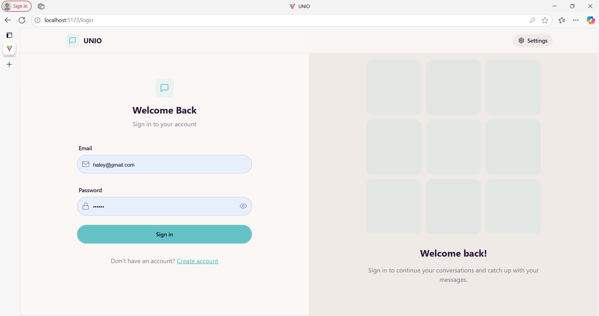
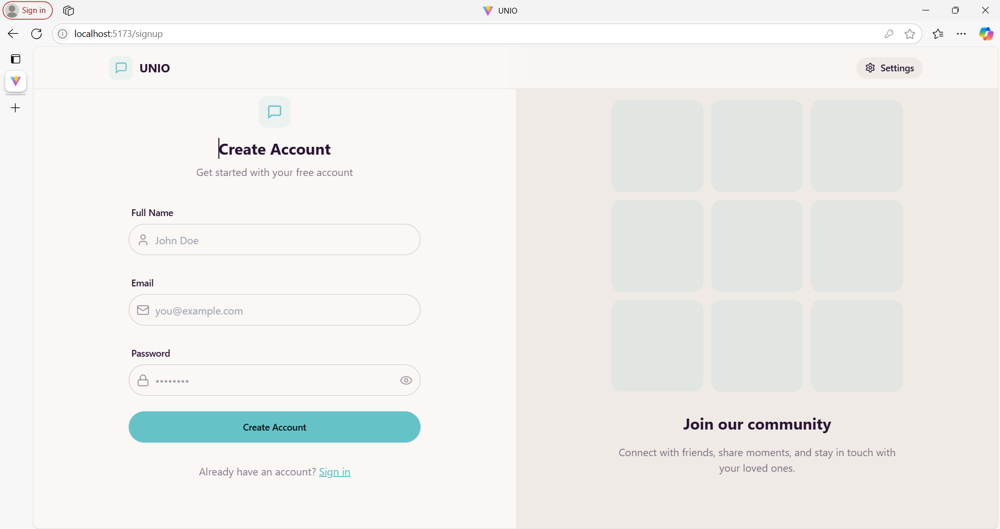
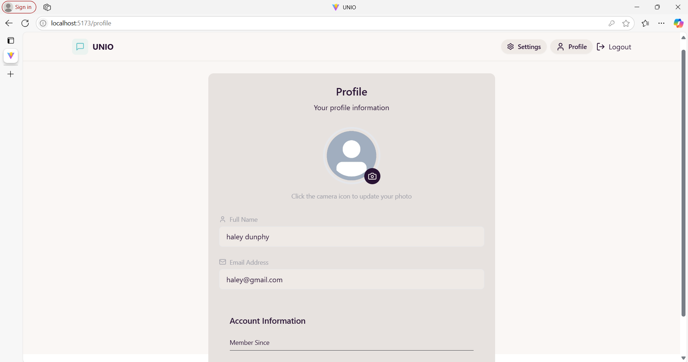
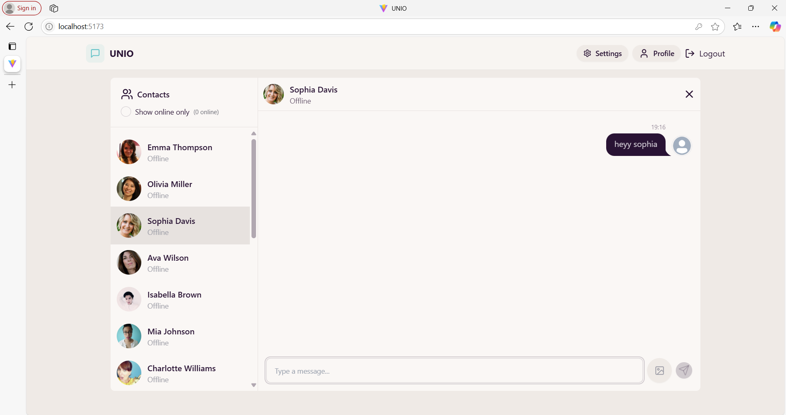

# UNIO

UNIO is a responsive, real-time chat application that allows users to communicate instantly. It features modern UI design, theming options, and secure user authentication.

## Features

- **Responsive UI:** Designed to work seamlessly on mobile, tablet, and desktop.
- **Real-Time Communication:** Instant messaging powered by [Socket.IO](https://socket.io/).
- **User Authentication:** Secure signup and login using JWT tokens and cookies.
- **Profile Management:** Update your profile, change UI themes, and logout.
- **Dynamic Theming:** Personalize your chat experience with a dedicated settings page.
- **Modern Design:** Built using Tailwind CSS and DaisyUI for a clean, modern look.
- **State Management:** Efficiently managed with Zustand.

## Technologies Used

### Backend
- **Node.js & Express.js:** Server-side runtime and framework.
- **MongoDB & Mongoose:** Database and object data modeling.
- **Socket.IO:** Real-time bidirectional event-based communication.
- **JWT & Cookies:** Authentication and session management.
- **Additional Libraries:**  
  - `bcryptjs` for password hashing  
  - `dotenv` for environment variable management  
  - `cookie-parser` and `cors` for middleware support

### Frontend
- **React & Vite:** Fast and modern web application setup.
- **Tailwind CSS & DaisyUI:** Utility-first CSS framework and component library.
- **Zustand:** Lightweight state management.
- **Axios:** HTTP client for API requests

---

## Screenshots

- **Login Screen**  
  

- **signup Page**  
  

- **Chat Interface**  
  

- **Profile Page**  
  

- **Settings Page (Theming)**  
  

- **messages Page**  
  

---

